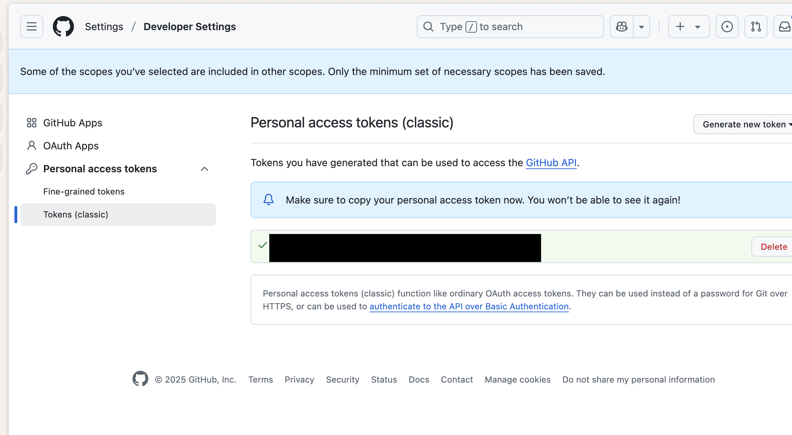
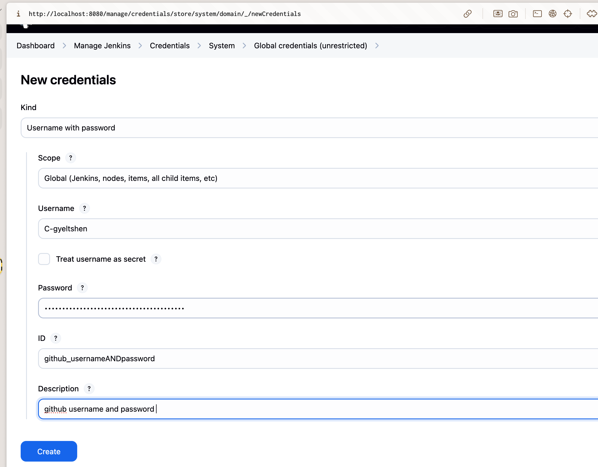
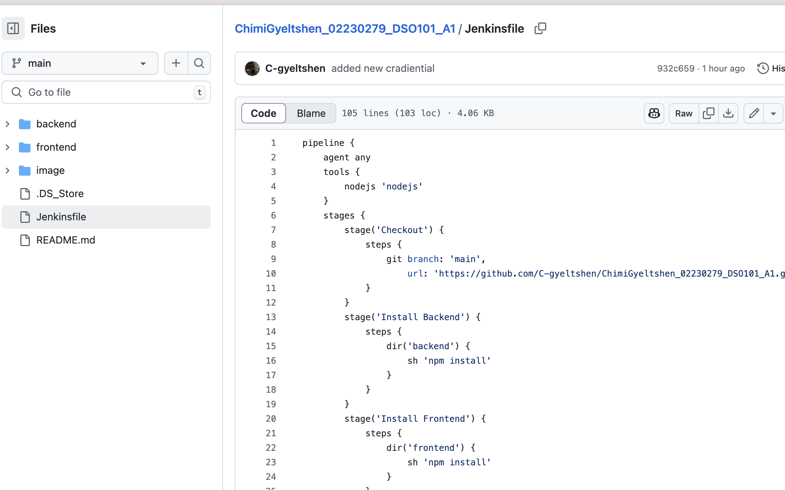
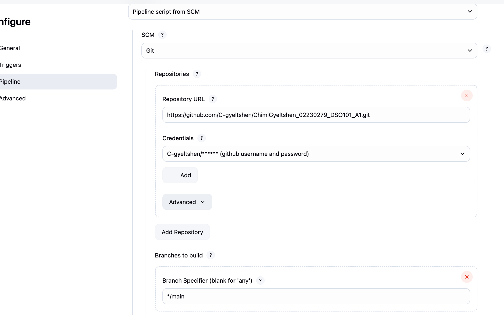
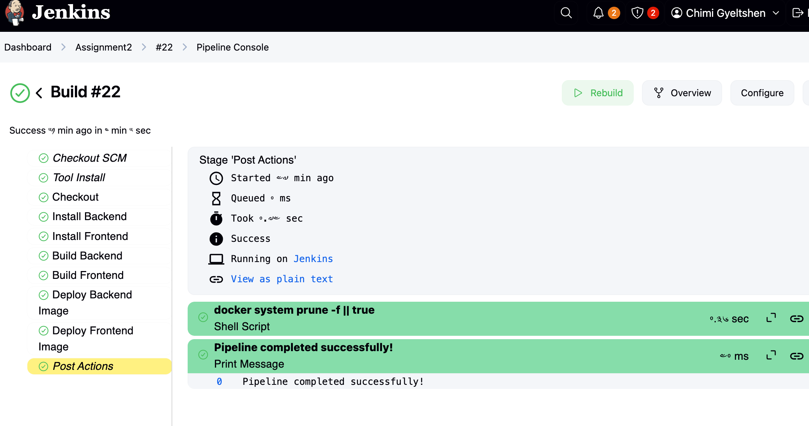
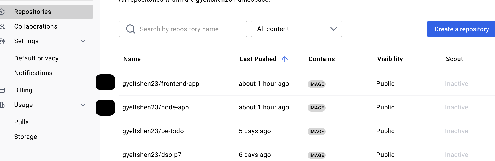

# Assignment II

**Continuous Integration and Continuous Deployment (DSO101)**  
**Bachelor's of Engineering in Software Engineering (SWE)**  

## 🎯 Objective

To configure a **Jenkins pipeline** to automate the **build, test**, and **deployment** of your **to-do list application (Assignment 1)** with the following:

- Code checkout from GitHub  
- Dependency installation (`npm/yarn`)  
- Build step  
- Unit testing (Jest/Mocha)  
- Deployment (Docker or server)

---

## 🛠 Tools & Technologies

| Tool | Purpose |
|------|---------|
| Jenkins | CI/CD automation |
| GitHub | Source code hosting |
| Node.js & npm/yarn | JavaScript runtime & package manager |
| Jest/Mocha/Chai | Testing frameworks |
| Docker (optional) | Containerization |

---

## ✅ Step-by-Step Tasks


### 🔧 Task 1: Jenkins Setup for Node.js

1. **Install Jenkins**  
   - Download from: [https://jenkins.io/download](https://jenkins.io/download)  
   - Run on: `localhost:8080`

2. **Install Required Plugins**  
   Navigate to `Manage Jenkins > Plugins > Available` and install:
   - NodeJS Plugin  
   - Pipeline  
   - GitHub Integration  
   - Docker Pipeline (if using Docker)

3. **Configure Node.js**  
   - Go to: `Manage Jenkins > Tools > NodeJS`  
   - Add Node.js (e.g., LTS v20.x)  
   - Ensure `npm`/`yarn` is detected

---

### 🌐 Task 2: GitHub Repository Setup

1. Lets use the same repository as Assignment 1.

    ***[Assignment1 Github Repositiry Link](https://github.com/C-gyeltshen/ChimiGyeltshen_02230279_DSO101_A1.git)***

2. **Generate GitHub Personal Access Token (PAT)**  
    - Go to: GitHub > Settings > Developer Settings > Personal Access Tokens 
    
    - Create token with `repo` and `admin:repo_hook` permissions

3. **Add GitHub Credentials in Jenkins**  
- Go to: `Manage Jenkins > Credentials > Add Credentials`  
- Type: Username & Password  
- Username: Your GitHub username  
- Password: Your PAT  
- ID: `github-credentials` (or any name you prefer)
- Description: `GitHub Credentials for CI/CD`

    

---

### 🚀 Task 3: Create Jenkinsfile in the root directory

1. **Create a `Jenkinsfile`**  
    ```bash 
    touch Jenkinsfile
    ```
2. **Add Pipeline Configuration**  
   Here’s a sample `Jenkinsfile` for your Node.js application:

    ```groovy
        pipeline {
        agent any
        tools {
            nodejs 'nodejs'
        }
        stages {
            stage('Checkout') {
                steps {
                    git branch: 'main',
                        url: 'https://github.com/C-gyeltshen/ChimiGyeltshen_02230279_DSO101_A1.git'
                }
            }
            stage('Install Backend') {
                steps {
                    dir('backend') {
                        sh 'npm install'
                    }
                }
            }
            stage('Install Frontend') {
                steps {
                    dir('frontend') {
                        sh 'npm install'
                    }
                }
            }
            stage('Build Backend') {
                steps {
                    dir('backend') {
                        sh 'npm run build || echo "No build script in backend"'
                    }
                }
            }
            stage('Build Frontend') {
                steps {
                    dir('frontend') {
                        sh 'npm run build || echo "No build script in frontend"'
                    }
                }
            }
            stage('Deploy Backend Image') {
                steps {
                    script {
                        // Using Secret text credential
                        withEnv(["PATH+DOCKER=/usr/local/bin"]) {
                            sh 'docker build -t gyeltshen23/node-app:latest -f backend/Dockerfile backend/'
                            withCredentials([string(credentialsId: 'docker-hub-creds', variable: 'DOCKER_PWD')]) {
                                sh 'echo $DOCKER_PWD | docker login -u gyeltshen23 --password-stdin'
                                sh 'docker push gyeltshen23/node-app:latest'
                            }
                        }
                    }
                }
            }
            stage('Deploy Frontend Image') {
                steps {
                    script {
                        withEnv(["PATH+DOCKER=/usr/local/bin"]) {
                            sh 'docker build -t gyeltshen23/frontend-app:latest -f frontend/Dockerfile frontend/'
                            withCredentials([string(credentialsId: 'docker-hub-creds', variable: 'DOCKER_PWD')]) {
                                sh 'echo $DOCKER_PWD | docker login -u gyeltshen23 --password-stdin'
                                sh 'docker push gyeltshen23/frontend-app:latest'
                            }
                        }
                    }
                }
            }
        }
        post {
            always {
                // Clean up Docker images to save space
                script {
                    withEnv(["PATH+DOCKER=/usr/local/bin"]) {
                        sh 'docker system prune -f || true'
                    }
                }
            }
            success {
                echo 'Pipeline completed successfully!'
            }
            failure {
                echo 'Pipeline failed. Check the logs for details.'
            }
        }
    }

    ```

#### Jnekinsfile performs the following tasks:

    1. ✅ **Checkout**  
        - Clones the project from GitHub.

    2. 📦 **Install Dependencies**  
        - Runs `npm install` for both `backend/` and `frontend/`.

    3. 🛠️ **Build Projects**  
        - Builds the backend and frontend using `npm run build` (if build scripts exist).

    4. 🐳 **Dockerize**  
        - Builds Docker images for backend and frontend.
        - Pushes them to Docker Hub using stored credentials.

    5. 🧹 **Cleanup**  
        - Removes unused Docker images to free space.

    6. 📢 **Notifications**  
        - Prints a success or failure message after the pipeline runs.

### Task 4: push the Jenkinsfile to your repository
1. **Commit and Push**  
   ```bash
   git add Jenkinsfile
   git commit -m "Add Jenkinsfile for CI/CD pipeline"
   git push origin main
   ```
2. **Verify in GitHub**  
   Ensure the `Jenkinsfile` is visible in your repository.

   

### Task 5: Create a Jenkins Pipeline Job
1. **Create a New Pipeline Job**  
   - Go to Jenkins Dashboard > New Item  
   - Enter a name (e.g., `Assignment2`)  
   - Select `Pipeline` and click `OK`

2. **Configure the Pipeline**
   - In the job configuration, scroll down to the `Pipeline` section  
   - Set `Definition` to `Pipeline script from SCM`  
   - Select `Git` as SCM  
   - Enter your repository URL: `https://github.com/C-gyeltshen/ChimiGyeltshen_02230279_DSO101_A1.git`

        

### Task 6: Build the Pipeline
1. **Run the Pipeline**  
   - Click `Build Now` in your Jenkins job  
   - Monitor the console output for build progress and results

        

- **Docker image pushed to Docker Hub:**

    


### Challenges 

- The `technological sytack` choosen uses `TypeScript`/modern JavaScript syntax (like type or .tsx), but Jest is not set up to understand it.

- **To fix i tried :** 

    - Added `babel` to handle TypeScript.

    - Update Jest config to support TypeScript files (.ts/.tsx) and modern syntax.